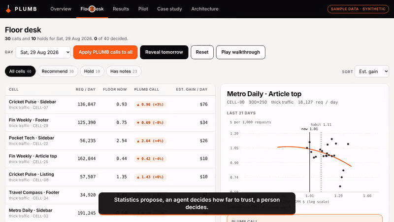
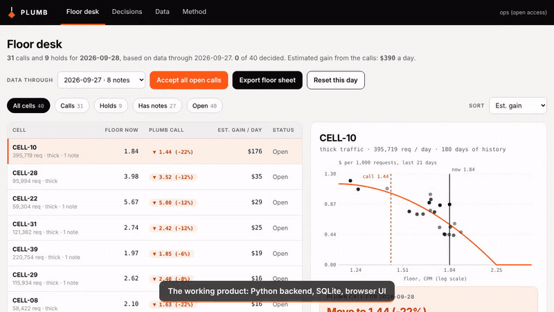
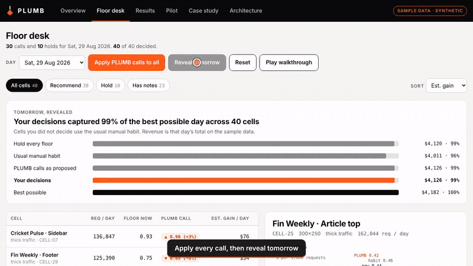
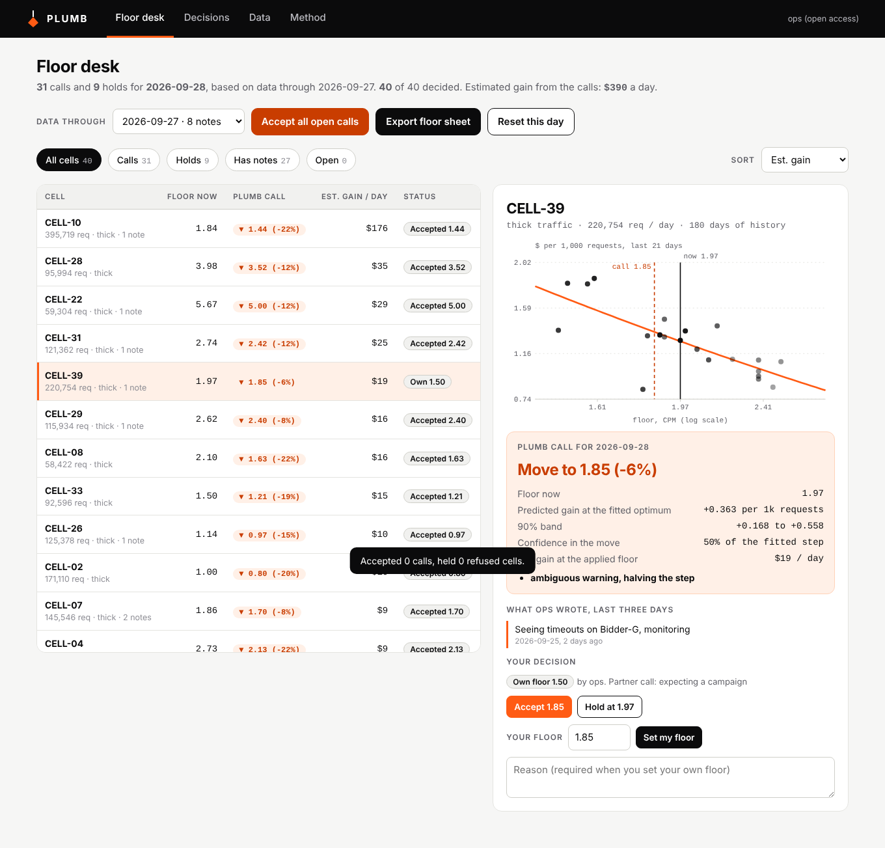
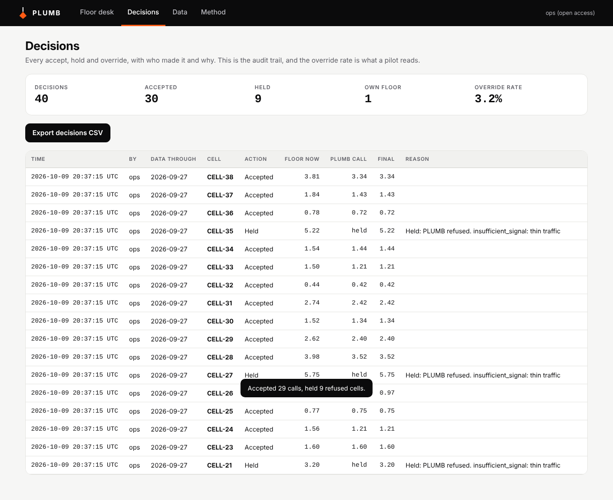
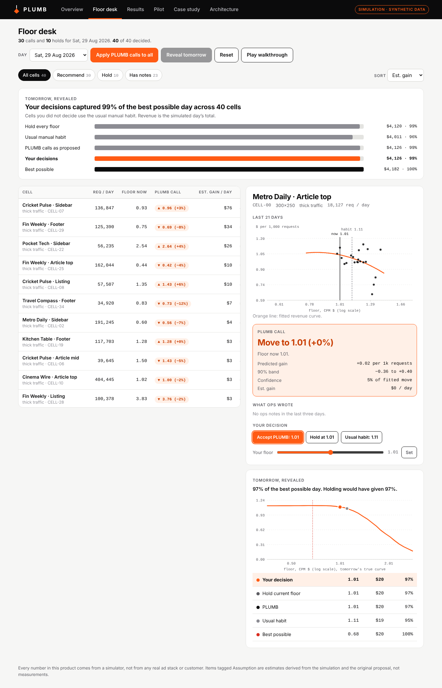

# PLUMB

**A floor price you can defend, or a plain "not enough signal."**
PLUMB is a floor-pricing partner for ad operations: a statistics layer proposes each floor, an agent decides how far to trust it (and can refuse), and a person makes the call. All data here is synthetic.

[](https://github.com/Johnbritt/Plumb-Floor-Pricing/actions/workflows/ci.yml)

100xEngineers Cohort 7 capstone, solo submission.

## See it in action

Full walkthrough (about 2 minutes, no audio): [`docs/media/plumb_walkthrough.mp4`](docs/media/plumb_walkthrough.mp4)

| Floor desk (product demo) | Web app |
|---|---|
|  |  |



## Live

| | |
|---|---|
| Product demo | https://plumb-floor-pricing-demo.vercel.app (tabs: Overview, Floor desk, Results, Pilot, Case study, Architecture) |
| Web app | `uvicorn app.main:app` (see [Run the web app](#run-the-web-app)) |
| Case study | https://plumb-floor-pricing-demo.vercel.app/#case, [PDF on Drive](https://drive.google.com/file/d/1QwukpT_6SO-xlgbReuY_GJ-QS8Q7R0-F/view?usp=sharing) ([in repo](docs/PLUMB_Case_Study.pdf)), or [`docs/CASE_STUDY.md`](docs/CASE_STUDY.md) |
| Pitch deck (Slides) | https://docs.google.com/presentation/d/1m3aTNOrSx-chyzpYhw6lZj0XDbfQKfaHLiLXOtkeatU/edit?usp=sharing |
| Demo video | [Product walkthrough on Drive](https://drive.google.com/file/d/1JGBBPzHxYWsa7dIzhTl8PS7_pQoKQXAo/view?usp=sharing) |
| Pitch deck | [`docs/pitch/PLUMB_Pitch_Deck.pdf`](docs/pitch/PLUMB_Pitch_Deck.pdf) ([.pptx](docs/pitch/PLUMB_Pitch_Deck.pptx)) |
| Pipeline JSON | [`workflow.json`](workflow.json) |

## Run the web app

A working product, not only a demo: a FastAPI backend with SQLite and a browser UI. Load your own daily data and ops notes, get a call per cell, accept, hold or override with a reason, and export the floor sheet for your ad server.

```bash
pip install -r requirements-app.txt
PLUMB_PASSWORD='choose-one' uvicorn app.main:app --port 8000     # http://localhost:8000, user: ops
```

It starts with the synthetic dataset loaded. Upload real data on the Data tab (templates provided), or set `PLUMB_SEED_DEMO=0` to start empty. Run it in Docker with the included `Dockerfile`, or on Render with `render.yaml`. Settings are in [`.env.example`](.env.example). API docs are served at `/docs`.

| Tab | Does |
|---|---|
| Floor desk | Queue of cells with PLUMB's call, chart, the ops notes it used, accept / hold / set your own floor, accept all, export floor sheet |
| Decisions | Audit trail with who, when and why; override rate; CSV export |
| Data | Upload daily rows and notes, load or clear demo data |
| Method | How a floor is set, the parameters in force, the caveats |





PLUMB suggests floors; it does not write to an ad server. Basic auth is a shared password, so put it behind HTTPS and your VPN or SSO. 11 tests cover the app end to end (`pytest -q`).

## What it does

- Fits revenue per 1,000 requests against log floor over the last 21 days for each placement (a "cell") and proposes a floor with a predicted gain and an uncertainty band. Plain statistics, no model.
- An agent reads the ops notes and returns a *trust plan*: hold on an outage, drop a bad reporting day, allow only a raise before a surge, ignore a benign alert. It never writes a price.
- The engine applies the plan deterministically: hard refusals for thin traffic or a barely varied floor, and a step shrunk by confidence and capped at 25% a day.
- A person accepts, holds, or sets their own floor in the floor desk. Every refusal comes back with its reason.



## Results (synthetic, held-out world)

Gates were tuned on one synthetic world and scored on a fresh one with thinner cells. 40 cells, 120 days, closed loop, same random draws across arms.

| Arm | Revenue vs best possible floor | Harmful moves | Calls refused |
|---|---|---|---|
| Ops alone (modelled manual habit) | 78.7% | 16.3% | 0% |
| Statistics layer, full step | 98.3% | 6.2% | 0% |
| Statistics layer, confidence-scaled step | 96.1% | 2.6% | 0% |
| Stats plus rule refusal | 95.0% | 3.0% | 17.7% |
| Stats plus agent refusal | 95.0% | 2.9% | 20.3% |
| Ops plus agent (the pair) | 95.3% | 6.1% | 19.5% |

What this does and does not show:
- The statistics layer produces the revenue gain, about 17 to 20 points over the modelled manual process.
- Refusal is a safety feature that costs 2 to 3 points of revenue in exchange for fewer harmful moves.
- The agent here is an offline keyword stand-in, not Claude, and it does not beat the plain rule baseline. The claim that an agent adds value is not proven. The Claude backend (`make_llm_agent`) is mock-tested only.
- The human in the pair arm is assumed and swept in a sensitivity analysis. It does not beat the model alone.

Design iterations, including the hard-gate version that refused 82% of days and cost revenue, are in [`docs/CASE_STUDY.md`](docs/CASE_STUDY.md), [`docs/RESULTS_DETAIL.md`](docs/RESULTS_DETAIL.md) and `results/results_v1.json`.

## Pilot plan, checked on sample data

[`src/pilot_sim.py`](src/pilot_sim.py) runs the proposed pilot design on the sample data: matched pairs, a shadow week, then half the cells on PLUMB, 100 runs per design plus an A/A control. The plan as first written (20 cells, one live week) cannot separate a real gain from noise, and its 5% harmful-move limit is below what the system itself produces. The revised design is 40 cells for five weeks, judged on a confidence bound against matched manual cells. See the Pilot tab in the demo.

## Stack

| Layer | Choice |
|---|---|
| Data generator and engine | Python, NumPy, pandas |
| Agent layer | Keyword stand-in (default), Claude backend via the Anthropic SDK (optional) |
| Web app | FastAPI, SQLite, vanilla JS UI, optional Docker |
| Demo | One self-contained HTML page, no backend, data baked in |
| Checks | pytest, GitHub Actions |

Details in [`ARCHITECTURE.md`](ARCHITECTURE.md).

## Project structure

```
app/                FastAPI backend (main, service, store, ingest, seed) and static UI
src/
  sim.py            world generator: second-price auction with a floor, events, free-text notes
  engine.py         stats fit, gates, confidence step, modelled ops habit, closed-loop run
  agents.py         heuristic_agent, make_llm_agent, prompt and plan schema
  evaluate.py       tune on world 1, freeze, score on world 2
  pilot_sim.py      pilot plan check
  demo_data2.py     snapshots 40 cells on three eventful days for the demo
  build_product.py  bakes results into the demo page
  make_report.py    exports the synthetic datasets, figures and case study
  paths.py          file locations
data/               synthetic datasets (daily cells, ground truth, ops notes)
results/            metrics, tuning grids, decisions, figures, pilot results
demo/               product template, baked page, demo data
docs/               case study and screenshots
tests/              pytest checks (engine, agent, data generator, web app)
Dockerfile, render.yaml, .env.example
workflow.json       pipeline description
```

## Data

Everything is generated by `src/sim.py` from fixed seeds. There is no real ad-stack, publisher or customer data anywhere in this repo. Datasets: `data/synthetic_daily_cells.csv` (7,200 cell-days under manual pricing), `synthetic_ground_truth.csv` (true best floor and event flags), `synthetic_ops_notes.csv` (what the agent reads) and `synthetic_ops_notes_truth.csv` (same, with the true note type).

## Run it locally

```bash
pip install -r requirements.txt
pytest -q                                   # about 2 seconds
cd src
python3 evaluate.py                         # tune, freeze, score; writes results/
python3 make_report.py                      # datasets, figures, case study
python3 pilot_sim.py 100 four_weeks         # also: as_written, forty_cells
python3 demo_data2.py && python3 build_product.py   # rebuild demo/index.html
```

Generated worlds are cached in `.cache/` and rebuild deterministically from the seeds. To try the Claude agent, set `ANTHROPIC_API_KEY` and swap `heuristic_agent` for `make_llm_agent()` in `evaluate.py`. Run it on a sample of cells first, because it makes one API call per decision.

## Known limitations

- The manual-pricing arm is a model of ops behaviour, not a measurement. The size of the gap to ops depends on it.
- Bidders in the sample data do not react to floors. Real bidders do.
- The human in the pair arm is an assumption, shown as a sensitivity analysis.
- Refusing on thin cells freezes learning, so those cells need a small randomized floor test. Not built yet.
- Holding through an outage can cost revenue, because an outage probably lowers the best floor. The agent should adjust direction, not only hold.
- All data in this repo and demo is synthetic; real platform data is confidential and not included. Figures labelled Assumption in the demo are estimates, not measurements.

## Next

1. Run the Claude-backed agent on a sample and compare against the rule arm.
2. Add the randomized floor test for thin cells and re-score.
3. Run the revised pilot and replace the modelled ops habit with real decisions from a shadow week.
