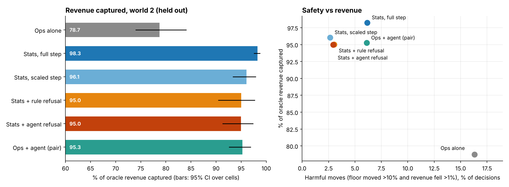
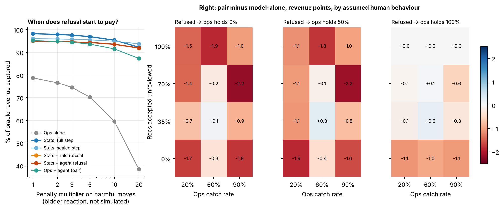

# PLUMB: results on sample data (synthetic)

**Everything here is computed on a synthetic sample dataset. No TapMind or other official data was used.** The data generator builds a bid landscape per placement cell, so the best floor is known exactly for every cell and day. That is what lets us score decisions properly. It also means every number below describes the simulated world, not your ad stack.

## What was built
| Piece | What it does |
|---|---|
| `sim.py` | 40 placement cells x 180 days. Second-price auction with a floor, daily demand shocks, and four event types: bidder outage, demand surge, reporting glitch, demand regime shift. Each event may or may not leave a free-text ops note; decoy and benign notes are added. |
| `engine.py` | Stats layer (quadratic revenue-vs-floor fit on the last 21 days, uncertainty on the predicted gain), rule gate, closed-loop runner where each arm lives with its own floor history, modelled ops person. |
| `agents.py` | Agent layer behind one interface. **Offline stand-in** (keyword rules over the notes) is what produced the numbers below. **Claude backend** is wired and unit-tested with a mock, but not run: this session has no API key. |
| `evaluate.py` | Six arms, cluster bootstrap over cells, refusal accounting, human-catch accounting, sensitivity sweeps. |

Evaluation protocol: gate thresholds tuned on 10 dev cells of world 1, then frozen and scored on **world 2**, a fresh world (new seed, thinner cells) never used for tuning: 4,800 floor decisions across 40 cells, 462 of them during an event. A decision is scored by the true revenue of the floor chosen, divided by the revenue at the true best floor.

## Results (world 2, held out)
| Arm | Revenue captured (95% CI) | Refused | Harmful moves |
|---|---|---|---|
| A. Ops alone (today) | 78.7% (74.0% to 84.0%) | 0.0% | 16.3% |
| B. Stats layer, no refusal, full step | 98.3% (97.6% to 98.8%) | 0.0% | 6.2% |
| C. Stats layer, confidence-scaled step | 96.1% (93.4% to 97.9%) | 0.0% | 2.6% |
| D. Stats + rule refusal (no notes) | 95.0% (90.5% to 97.7%) | 17.7% | 3.0% |
| E. Stats + agent refusal (model alone) | 95.0% (91.4% to 97.3%) | 20.3% | 2.9% |
| F. Ops + agent (the pair) | 95.3% (92.6% to 96.9%) | 19.5% | 6.1% |

## Scorecard against the submission's claims
| Claim in the doc | Verdict on the sample data | Evidence |
|---|---|---|
| The pair beats ops alone | **Supported** (but see caveat 1) | +16.5 pts, CI +11.5 to +21.3 |
| The pair beats the model alone | **Not supported** | +0.3 pts, CI -0.8 to +1.5; across 36 human-behaviour settings it ranges -2.2 to +0.3 pts |
| Refusal improves outcomes | **Safety yes, dollars no** | Harmful moves fall from 6.2% to 2.9%, but refusal and step-scaling cost 2.2 to 3.3 pts of revenue vs the unguarded stats layer |
| The agent beats a plain rule (Null Test) | **Not shown** by the stand-in | agent minus rule: -0.1 pts, CI -0.8 to +1.0. The stand-in is itself a rule set, so this needs the Claude run |
| The human catches what the agent misses | **Weak** | 30 of 234 harmful recs caught; net $-22. Wrong overrides (232, at an assumed 10% false-override rate) cost $1,430 |

**The honest headline:** the statistical layer does almost all the work, about 20 points over the modelled manual process. Refusal is a safety feature that costs some revenue in this world. The model's own contribution is unproven until the Claude backend is run.

## Design changes the findings forced (use these for the build-journey slide)
1. **Hard significance gate refused 81.8% of days (v1) and cost 1.7 pts vs the unguarded stats layer.** Replaced with a confidence-scaled step: refuse only on data-quality problems, otherwise let confidence shrink the move. Refusals fell to 17.7%.
2. **The v1 safety metric was contaminated by the exploration dither** (a held floor looked "harmful" just from random jitter). Replaced with: floor moved more than 10% and revenue fell more than 1%.
3. **Refusing on thin cells freezes learning.** On the thinnest cells, refusal arms capture 77.1% vs 80.8% for ops and 98.2% for the unguarded layer: a refused cell stays stuck at its starting floor. Next iteration: pair "insufficient signal" with a small randomized floor test so the cell gathers data, or pool thin cells with similar ones.
4. **Notes-driven holds hurt during outages.** Agent minus rule on event days: $-619. Likely cause: an outage removes bidders, which lowers the best floor, so freezing the floor is the wrong response. I have not isolated this, but it points to an agent that adjusts direction instead of just holding.

Left: if a harmful move carries a penalty beyond its same-day revenue loss (bidders pulling back, persistence), the guarded arms close the gap. At 20x the scaled-step arm overtakes the full-step arm. Right: the pair never reliably beats the model alone. Two things drive this: refusals hand decisions back to a human whose manual process is the weakest arm, and wrong overrides cost more than catches save.

## Caveats you must state in the deck
1. **The ops arm is my model of manual pricing** (nudge the floor toward a believed fill rate, with noise). The size of the gap to ops depends on that assumption. Real ops colleagues must run the human arm; until then, quote the direction, not the size.
2. **No bidder reaction.** Real bidders adapt to floors. The multiplier chart shows how much that would have to matter.
3. **The pair arm uses an assumed human** (accept, catch and false-override rates). It is a sensitivity analysis, not a measurement.
4. **The agent arm is a keyword stand-in, not Claude.** Do not present it as an LLM result.
5. Two synthetic worlds, one seed each. Intervals are cluster bootstraps over cells, so they do not capture world-to-world variation.
6. The $2.5K to $5K a month figure in the doc is not supported by this analysis. The gains here are percentages of oracle revenue, not rupees.

## Files
`synthetic_daily_cells.csv` (7,200 cell-days under manual pricing: requests, floor, fill, revenue), `synthetic_ground_truth.csv` (true best floor and event flags), `synthetic_ops_notes.csv` (what the agent reads), `synthetic_ops_notes_truth.csv` (same plus true note type), `eval_decisions_world2.csv` (all decisions, all arms), `results_v1.json`, `results_v2.json`, `tuning_grid_v1.csv`, `tuning_grid_v2.csv`, and the code.

## Run it
`python3 evaluate.py` reproduces everything (about 2 minutes). With `ANTHROPIC_API_KEY` set, replace `heuristic_agent` with `make_llm_agent()` in `evaluate.py`. Run it on a sample of cells first: it makes one API call per decision, so the full run is about 9,600 calls across the agent and pair arms.
